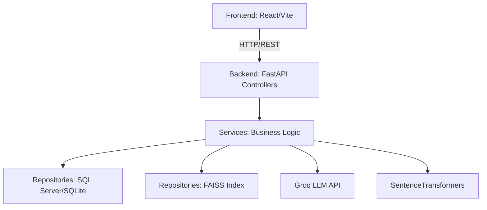
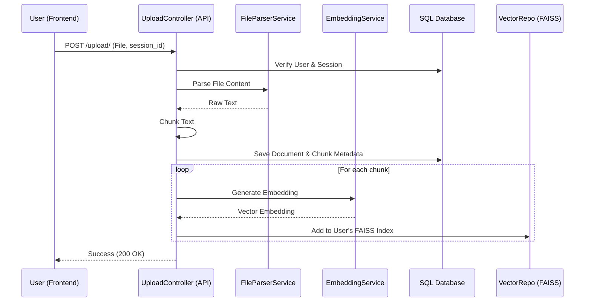
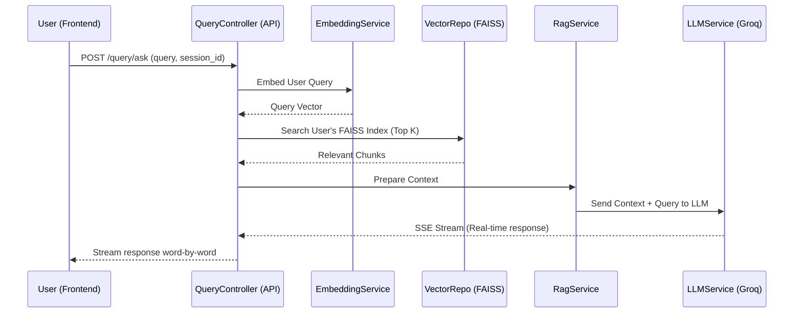

# Enterprise RAG System

This document provides a detailed walkthrough of the Enterprise RAG (Retrieval-Augmented Generation) application, covering its architecture, backend structure, frontend implementation, and core workflows. 

Recently, the system underwent an enterprise-grade refactoring to centralize configurations, support advanced file types, and clean up the architecture.

## 1. System Architecture Overview

The system is a full-stack web application designed for processing documents, indexing them for search using vector embeddings, and allowing users to query the processed knowledge base utilizing LLMs.



**Tech Stack:**
*   **Frontend:** React, Vite, Tailwind CSS, React Router.
*   **Backend:** FastAPI (Python), SQLAlchemy (ORM).
*   **Database:** SQL Server (via pyodbc) / SQLite.
*   **Vector Store:** FAISS (Facebook AI Similarity Search) - Local file-based storage.
*   **AI/LLM Integration:** 
    *   **Embeddings:** `all-MiniLM-L6-v2` (SentenceTransformers) for generating vector representations of text chunks.
    *   **LLM:** `llama-3.1-8b-instant` via Groq for generating answers.

**Design Pattern:**
The backend strictly adheres to an **API -> Service -> Repository** architectural pattern:
*   **API (Controllers):** Handles HTTP requests, input validation, and routing.
*   **Services:** Contains business logic (e.g., parsing files, interacting with LLMs, managing auth).
*   **Repositories:** Abstraction layer for data access (SQL database and FAISS vector index).

---

## 2. Backend Breakdown

The backend is organized into clearly defined modules within the `backend/` directory. All "magic strings" and "magic numbers" have been removed from individual services and controllers, ensuring a robust, easily configurable enterprise application.

### `core/` (Configuration & Security)
*   **`config.py`**: Centralized configuration management using nested classes. It loads environment variables (`.env`) for secrets like `GROQ_API_KEY`, `DATABASE_URL`, and JWT `SECRET_KEY`. Configurations include:
    *   `AppConfig`: Application name, version, and CORS origins.
    *   `SecurityConfig`: JWT algorithms, expirations, and URLs.
    *   `LLMConfig`: ChatGroq model names, system prompts, and history token limits.
    *   `VectorStoreConfig`: FAISS dimensions, search neighbor limits (k), and embedding models.
    *   `UploadConfig`: File chunk sizes and allowed extensions.
*   **`security.py`**: Handles JWT (JSON Web Token) creation, validation, and password hashing using `passlib` and `python-jose`. It provides the `get_current_user` dependency used to protect API routes.

### `db/` (Database Models)
*   **`database.py`**: Sets up the SQLAlchemy engine and declarative base.
*   **`models.py`**: Defines the SQL schema, including tables for:
    *   `users`: Authentication and profile data.
    *   `chat_sessions`: Groupings of messages and uploaded documents.
    *   `chat_messages`: Individual Q&A interactions.
    *   `documents`: Metadata for uploaded files.
    *   `document_chunks`: The actual split text segments derived from documents.

### `repositories/` (Data Access Layer)
*   **`user_repo.py`, `chat_repo.py`, `document_repo.py`**: Manage CRUD operations for their respective SQL tables.
*   **`vector_repo.py` (`VectorRepo`)**: A critical component that manages the FAISS index. Crucially, it creates a separate FAISS index file for each user (`{user_id}_index.faiss`) to ensure **strict data isolation** between tenants.

### `services/` (Business Logic)
*   **`auth_service.py`**: Handles user registration and login flows.
*   **`file_parser_service.py`**: Processes various document types (`.txt`, `.md`, `.pdf`, `.docx`, images) to extract raw text (see Advanced File Parsing below).
*   **`embedding_service.py`**: Uses SentenceTransformers to convert text chunks into vector embeddings.
*   **`llm_service.py`**: Communicates with the Groq API to stream LLM responses based on context and prompts.
*   **`rag_service.py`**: Orchestrates the RAG process (retrieval and generation).

### `api/controller/` (Routing)
*   **`auth_controller.py`**: Endpoints for `/login` and `/register`.
*   **`upload_controller.py`**: Handles file uploads. It reads the file, parses it, chunks the text, saves metadata to the SQL database, generates embeddings, and adds them to the user's FAISS index.
*   **`query_controller.py`**: Handles user questions. It embeds the query, searches the user's FAISS index for relevant chunks, and passes the context to the LLM to generate an answer.

---

## 3. Frontend Breakdown

The frontend is a React Single Page Application (SPA) located in the `frontend/` directory.

### Core Structure
*   **`src/main.jsx`**: The application entry point.
*   **`src/App.jsx`**: Implements routing using `react-router-dom`. It defines public routes (`/login`, `/register`) and a protected route (`/`) wrapped in a `<PrivateRoute>`.
*   **`src/config.js`**: Centralized frontend configuration.
    *   Extracted the hardcoded `http://localhost:8000` base URL.
    *   Connected the UI labels and accepted file inputs to the global `config.SUPPORTED_FILES`.
*   **`src/index.css` & `tailwind.config.js`**: Handles styling using Tailwind CSS.

### Components (`src/components/`)
*   **`Login.jsx` & `Register.jsx`**: Authentication views that dynamically pull the API URL from the config object.
*   **`Dashboard.jsx`**: The main application interface. It handles:
    *   **Sidebar:** Managing chat sessions (creating, switching, deleting).
    *   **Chat Area:** Displaying message history and providing an input for new queries.
    *   **Document Management (Right Panel):** Uploading files, viewing uploaded documents for the current session, and deleting documents.

---

## 4. Advanced File Parsing Integration

The upload process supports a robust set of file formats via the `FileParserService`. It effectively traps exceptions during file reads and prevents the server from crashing on malformed files.

*   **PDFs**: Implemented `pypdf` to extract text from all pages robustly.
*   **DOCX**: Implemented `python-docx` to read paragraphs.
*   **Images**: Implemented an automated OCR & Description pipeline. We encode the uploaded image to Base64 and send it to Groq's cutting-edge `llama-3.2-11b-vision-preview` model, which extracts the text and describes diagrams perfectly for the FAISS vector store.

---

## 5. Core Workflows

### A. Document Upload & Indexing Flow



1.  **User Action:** User selects a file in the frontend Dashboard and clicks upload.
2.  **Frontend Request:** Sends a `POST /upload/` with the file, `session_id`, and JWT token.
3.  **Backend Processing (`upload_controller.py`):**
    *   Verifies the user and session.
    *   Parses the file content using `FileParserService`.
    *   Splits the text into smaller chunks.
    *   Saves document and chunk metadata to the SQL database.
4.  **Vectorization:**
    *   Iterates through the chunks, generating embeddings via `embedding_service`.
    *   Adds the embeddings and source metadata to the user's isolated FAISS index (`vector_repo.add`).

### B. Query & Retrieval (RAG) Flow



1.  **User Action:** User types a question and submits it.
2.  **Frontend Request:** Sends a `POST /query/ask` containing the query, `session_id`, and settings (like `document_only` mode).
3.  **Retrieval (`query_controller.py`):**
    *   Generates an embedding for the user's query.
    *   Searches the user's FAISS index to find the top `K` most similar text chunks across all documents in that specific session.
4.  **Generation:**
    *   Combines the retrieved chunks into a context string.
    *   Sends the context, user query, and chat history to the LLM.
5.  **Response:** The backend returns an SSE (Server-Sent Events) stream, allowing the frontend to display the LLM's response word-by-word in real-time.

---

## 6. Key Security & Design Features

*   **Tenant Data Isolation:** The most critical feature is the separation of FAISS indexes per user. This ensures User A can never query or retrieve data from User B's uploaded documents.
*   **Session-Based Context:** RAG retrieval can be scoped to specific chat sessions, allowing users to have isolated conversations about different sets of documents.
*   **Robust Configuration:** The backend uses a heavily structured configuration system, making it easy to change models, API keys, chunk sizes, and database connections via environment variables.

---

## 7. Docker Deployment & Orchestration

The application is fully containerized and includes a unified `docker-compose.yml` file at the root for easy orchestration of both the frontend and backend services.

### Running the Application via Docker
From the root directory, simply run:
```bash
docker-compose up --build
```

This single command will:
1. **Build the Backend API**: Uses the `backend/dockerfile` to package the FastAPI application, install Python dependencies from `requirements.txt`, and expose port `8000`.
2. **Build the Frontend SPA**: Uses the multi-stage `frontend/Dockerfile` to build the Vite/React application and serve the static files via an Nginx web server on port `80`.
3. **Network & Dependencies**: Orchestrates the startup sequence (frontend depends on API) and connects them over a unified Docker network.

*Note: Ensure your `.env` variables are correctly set within the `backend/` directory before building the image.*
